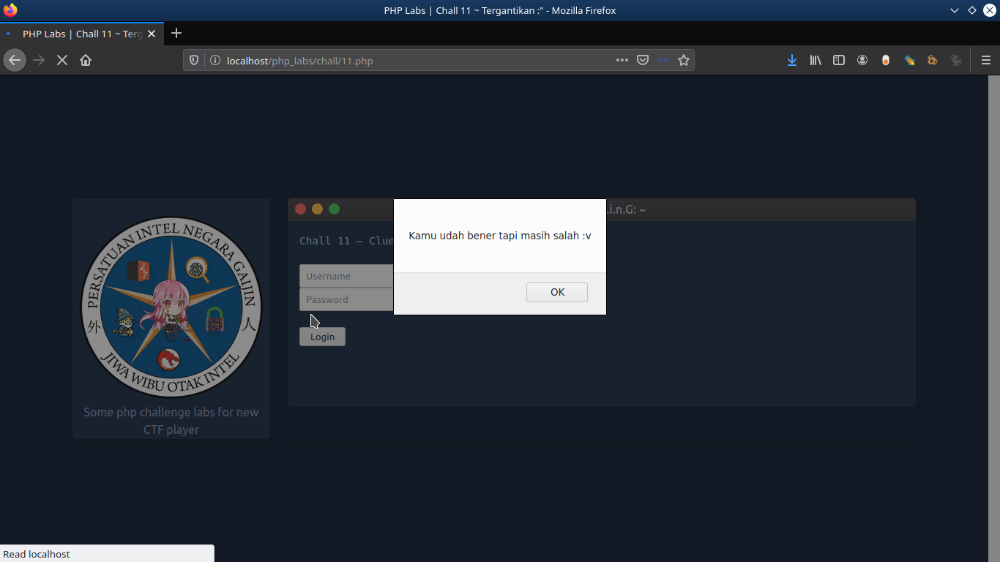
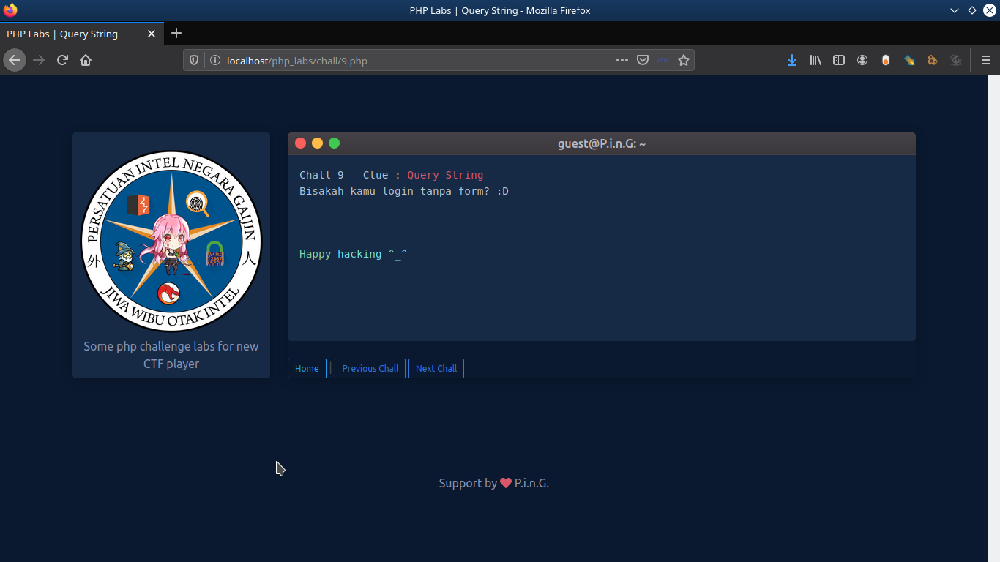

## PHP Labs

 
Some php challenge labs for new CTF player 

### List of Chall :
<pre>
~ Chall 1 | Md5 collision
~ Chall 2 | Strcmp
~ Chall 3 | Magic Hash
~ Chall 4 | Magic Hash++ 
~ Chall 5 | Cookie
~ Chall 6 | Browser
~ Chall 7 | Tipe Data
~ Chall 8 | Hidden & Encode
~ Chall 9 | Query String
~ Chall 10 | POST Extract
~ Chall 11 | Tergantikan :"
~ Chall 12 | PHP Shell
~ Chall 13 | Referer
~ Chall 14 | Eval
~ Chall 15 | Non-alphanumeric 
</pre>

### Screenshot :
 

### Instalation :
<ul>
  <li>Run your web server (XAMPP / LAMPP)</li>
  <li>Clone the repository and put the files in the /htdocs/php_labs</li>
  <li>You can akses http://localhost:8080/php_labs</li>
  <li>Happy Hacking ^_^</li>
</ul>

 
 

Thanks to Tegal1377 for References